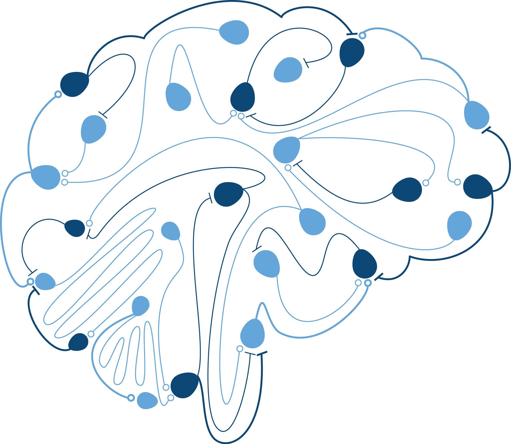

.. dipde documentation master file, created by
   sphinx-quickstart on Thu Mar  5 20:17:50 2015.
   You can adapt this file completely to your liking, but it should at least
   contain the root `toctree` directive.

Welcome to dipde's documentation!
=================================

.. include:: ../README.md

The population density approach in computational neuroscience seeks to understand the statistical evolution of a large population of homogeneous neurons. 
Beginning with the work of Knight and Sirovich [#]_ (see also [#]_), the approach typically formulates a partial integro-differential equation for the evolution of the voltage probability distribution receiving synaptic activity, and under the influence of neural dynamics.
Neuronal dynamics typically follow from the assumption of a leaky integrate-and fire model. 
We implement a numerical scheme for computing the time evolution of the master equation for populations of leaky integrate-and-fire neurons with shot-noise synapses (for a similar approach, see [#]_).

For a Quick Start, you can begin with the :ref:`ref-examples`. For a  more complicated example, check out the :ref:`ref-column`, a 16 population example based on the Potjans and Diesmann [#]_ leaky integrate-and-fire cortical column model.   

Details on the classes used to define a dipde simulation can be found in :ref:`ref-internals`. 

Contents:
==================

.. toctree::
   :maxdepth: 4

   user
   dipde
   dipde.column
   

  
dipde Team
==================

DiPDE is developed by the Modeling, Analysis and Theory group at the Allen Institute, with contributions from Nicholas Cain, Ram Iyer, Vilas Menon, Michael Buice, Tim Fliss, Keith Godfrey, David Feng, and Stefan Mihalas. 
  
Indices and tables
======================

* :ref:`genindex`
* :ref:`modindex`
* :ref:`search`

Citations
==================

.. [#] Knight, N.W., Manin, D., & Sirovich, L. (1996) `Dynamical models of interacting neuron populations in visual cortex <http://www.brown.edu/academics/applied-mathematics/sites/brown.edu.academics.applied-mathematics/files/uploads/Dynamical%20models%20of%20interacting%20neuron%20populations%20in%20visual%20cortex.pdf>`_. Symposium on Robotics and Cybernetics; Computational Engineering in Systems Application: 1–5.
.. [#] Omurtag, A., Knight, B.W., & Sirovich, L. (2000) `On the Simulation of Large Populations of Neurons <http://www.ncbi.nlm.nih.gov/pubmed/10798499>`_. *Journal of Computational Neuroscience* 8: 51–63.
.. [#] de Kamps M. (2003) `A simple and stable numerical solution for the population density equation <http://www.mitpressjournals.org/doi/abs/10.1162/089976603322297322?url_ver=Z39.88-2003&rfr_id=ori%3Arid%3Acrossref.org&rfr_dat=cr_pub%3Dpubmed&#.VYH9oxNViko>`_. *Neural Computation* 15: 2129–2146.
.. [#] Potjans T.C., & Diesmann, M. (2014) `The cell-type specific cortical microcircuit: relating structure and activity in a full-scale spiking network model <http://cercor.oxfordjournals.org/content/early/2012/11/30/cercor.bhs358.full>`_. *Cerebral Cortex* 24: 785–806.

dipde Manuscripts and Posters
====================================

.. [#] Cain, N., Iyer, R., Koch, C., & Mihalas, S. (2015) The computational properties of a simplified cortical column model. *In Preparation*.
.. [#] Cain, N., Fliss, T., Menon, V., Iyer, R., Koch, C., & Mihalas, S. (2014) `Simulations of the statistics of firing activity of neuronal populations in the entire mouse brain`_. Program No. 160.02/GG10. 2013 Neuroscience Meeting Planner. Washington, DC: Society for Neuroscience, 2014. Online. 
.. [#] Iyer, R., Menon, V., Buice, M., Koch, C., & Mihalas, S. (2013). `The Influence of Synaptic Weight Distribution on Neuronal Population Dynamics`_. *PLoS Computational Biology*, 9(10), e1003248. doi:10.1371/journal.pcbi.1003248
.. [#] Iyer, R., Cain, N., & Mihalas, S. (2014). `Dynamics of excitatory-inhibitory neuronal networks with exponential synaptic weight`_ . Cosyne Abstracts 2014, Salt Lake City USA.

.. _Simulations of the statistics of firing activity of neuronal populations in the entire mouse brain: http://www.sfn.org/~/media/SfN/Documents/Annual%20Meeting/FinalProgram/NS2013/DailyBooks2013/AM13Book3_Sunday.ashx
.. _The Influence of Synaptic Weight Distribution on Neuronal Population Dynamics: http://journals.plos.org/ploscompbiol/article?id=10.1371/journal.pcbi.1003248
.. _Dynamics of excitatory-inhibitory neuronal networks with exponential synaptic weight: http://cosyne.org/cosyne14/Cosyne2014_program_book.pdf

Citing dipde
================
Website: © 2015 Allen Institute for Brain Science.  DiPDE Simulator [Internet]. Available from: https://github.com/AllenInstitute/dipde.

